<p align="center">
  
</p>

### A cross-platform, high-performance pipe organ sample player compatible with Hauptwerk sample sets.

https://github.com/user-attachments/assets/f9e38610-aaf4-4b95-8d1c-e8f7f04b7d77

<!-- hero: the demonstration clip goes on the next line, as a github.com/user-attachments URL -->
**[Watch the demonstration](https://bonninr.github.io/masterpiece/#hear)** — thirty-three works on nine organs, recorded from the application's own output · [programme and credits](ATTRIBUTION.md#music)  
**[Watch "New tested instruments"](https://bonninr.github.io/masterpiece/#hear-2)** — thirty works on fifteen organs, filmed from the running console · [programme and credits](https://bonninr.github.io/masterpiece/attribution-2.html)

[](https://github.com/bonninr/masterpiece/releases/download/v0.5.4/masterpiece-0.5.4-windows-setup.exe)
[](https://github.com/bonninr/masterpiece/releases/download/v0.5.4/masterpiece-0.5.4-macos-arm64.zip)
[](https://github.com/bonninr/masterpiece/releases/download/v0.5.4/masterpiece-0.5.4-macos-x86_64.zip)
[](https://github.com/bonninr/masterpiece/releases/download/v0.5.4/masterpiece-0.5.4-linux-amd64.deb)
[](https://github.com/bonninr/masterpiece/releases/download/v0.5.4/masterpiece-0.5.4-linux-arm64.deb)
[](https://github.com/bonninr/masterpiece/releases/download/v0.5.4/masterpiece-0.5.4-linux-armhf.deb)

Portable archives for every platform, and the plugins on their own, are on the
[releases page](https://github.com/bonninr/masterpiece/releases/latest).

[](https://github.com/bonninr/masterpiece/actions/workflows/build.yml)
[](https://github.com/bonninr/masterpiece/releases)
[](https://en.cppreference.com/w/cpp/20)
[](https://juce.com/)
[](https://cmake.org/)
[](#building)
[](#building)
[](LICENCE)

---

## What it is

A pipe organ is not one instrument but thousands. Every pipe sounds exactly
one note in one colour, so a single stop -- a Principal 8', say -- is a row of
56 separate pipes, one per key. The organist draws stops to choose which rows
speak, couples keyboards together, and plays on several manuals and a
pedalboard. Wind from the bellows reaches the pipes through the chests, and
the building itself is half the sound.

A virtual pipe organ (VPO) recreates a specific instrument from recordings. A
producer records every pipe of a real organ, one at a time, in its own church:
the start of the note, a stretch of steady tone that can be looped for as long
as a key is held, and the release with the room's reverberation dying away --
often several releases, because a note held for a beat decays differently
from one held for a bar. Key action, stop and blower noises are recorded too.
The result is a sample set of tens of thousands of files and many gigabytes,
shipped with a definition of the instrument: which pipes each stop owns, what
the couplers and pistons do, how the console looks, how the wind and the swell
box behave.

The player software turns that library back into an organ. It draws the
console, so stops can be drawn with the mouse or from MIDI hardware, and for
every key pressed it works out which pipes should speak -- through the stops,
couplers and switch network, wired exactly as on the original console. For
each pipe it plays the right recording, loops the sustain without a seam,
chooses the release that matches how long the note was held, tunes it to the
chosen temperament, and applies what the definition asks of the instrument:
tremulants, swell shades, the wind sagging under a full chord. All of it is
mixed in real time, with latency low enough to play from a keyboard. Connect a
MIDI keyboard or a whole console, load a set, and you have that organ at home.

Masterpiece is such a player. It reads unencrypted Hauptwerk-format sets
directly, so existing libraries transfer without conversion; copy-protected
(.hbw/.hbx) sets are reported, not played, and remain locked to the program
they were encrypted for. GrandOrgue, the open-source incumbent, uses its own
`.organ` definition format and is not a source of sets here. Masterpiece is an
independent GPL-3.0-only implementation. It runs as a standalone application
and as a VST3 or LV2 plugin — the same engine either way. On macOS it is also
built as an Audio Unit, for Apple silicon and Intel. Platforms are Windows,
macOS, Linux, and Raspberry Pi.

The differentiator is resource use. The sampler streams release tails from
disk into per-voice ring buffers while attacks and sustain loops stay
resident, with 24-bit bit-exact, 16-bit, and mono-folding options plus a
decoded sample cache. Measured on Friesach (44 stops, 17 GB, 12148 files):
21.6 GB as 32-bit float resident becomes 16.2 GB at 24-bit, 4.7 GB streamed
stereo 16-bit, 2.3 GB streamed mono 16-bit; open time 77 s to 26 s. Streaming
assumes SSD-class storage. Method and full figures: [PERFORMANCE.md](PERFORMANCE.md).

---

## The console

The same program, reading different libraries.

| | |
|:--:|:--:|
| **Lipiny** — a historic case, drawstops lettered in Fraktur | **Melcer Chamber Music Hall** |
|  |  |
| A. Volkmann, 1898 · 25 stops · [sample set by Piotr Grabowski](https://piotrgrabowski.pl/lipiny/) | chamber organ · [sample set by Piotr Grabowski](https://piotrgrabowski.pl/melcer-chamber-music-hall/) |
| **Azzio** | **Kraków, St. John Cantius** |
|  |  |
| Mascioni, 2016 · 12 stops · [sample set by Piotr Grabowski](https://piotrgrabowski.pl/azzio/) | 40 stops, three manuals · [sample set by Piotr Grabowski](https://piotrgrabowski.pl/cracow-st-john-cantius/) |
| **Długa Kościelna** | **Raszczyce** |
|  |  |
| 22 stops · [sample set by Piotr Grabowski](https://piotrgrabowski.pl/dluga-koscielna/) | Vermeulen, 1965 · 21 stops · [sample set by Piotr Grabowski](https://piotrgrabowski.pl/raszczyce/) |
| **Strassburg** | **Friesach** — three manuals, jambs on their own pages |
|  |  |
| C. Werner, 1743 · 20 stops · [sample set by Piotr Grabowski](https://piotrgrabowski.pl/strassburg/) | Eisenbarth, 2000 · 44 stops · [sample set by Piotr Grabowski](https://piotrgrabowski.pl/friesach/) |
| **Nancy** — four manuals; the keys are part of the photograph, and the drawstops are colour-coded by division | **Lemmer** — a Flentrop under the saints, with the recording perspective on the case |
|  |  |
| 65 stops, four manuals · [sample set by Piotr Grabowski](https://piotrgrabowski.pl/nancy/) | Flentrop, 1977–78 · 9 registers · [sample set by Augustine's Virtual Organs](https://hauptwerk-augustine.info/Lemmer.php) |
| **Giubiasco** | **Alessandria** — pipes reached through pallet switches |
| 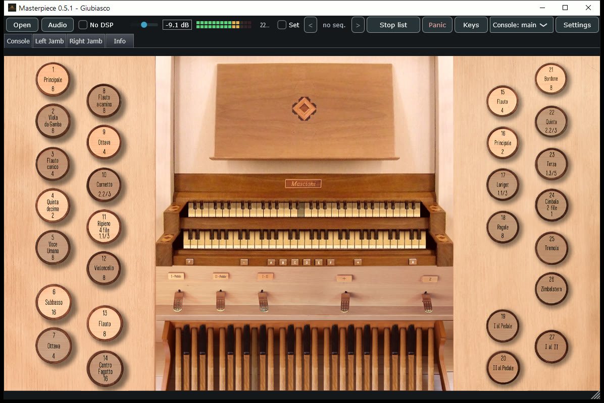 | 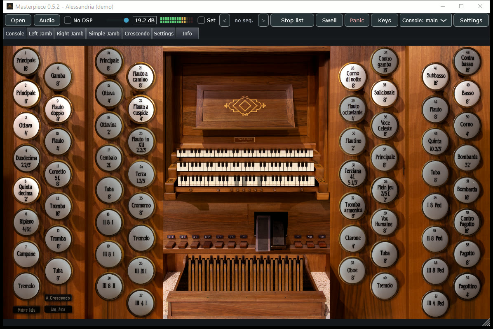 |
| complete set · [sample set by Piotr Grabowski](https://piotrgrabowski.pl/giubiasco/) | demonstration set · [sample set by Piotr Grabowski](https://piotrgrabowski.pl/alessandria/) |
| **Pinerolo** | **Ermelo** |
| 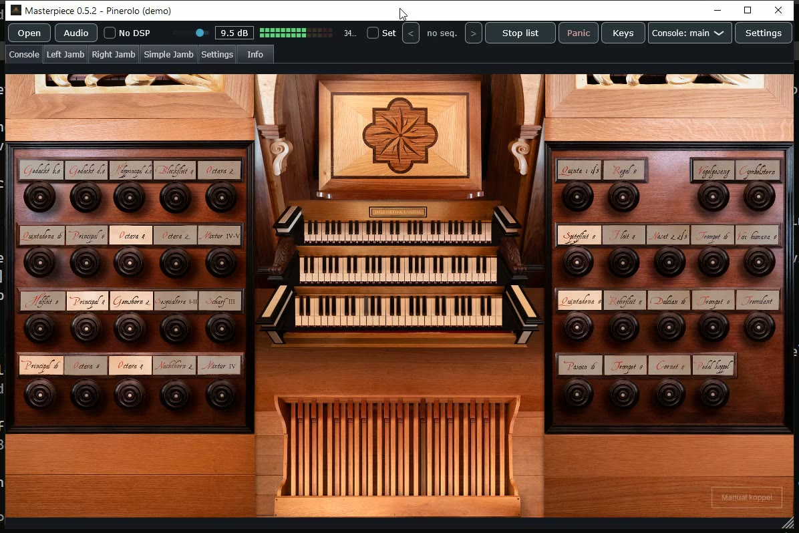 | 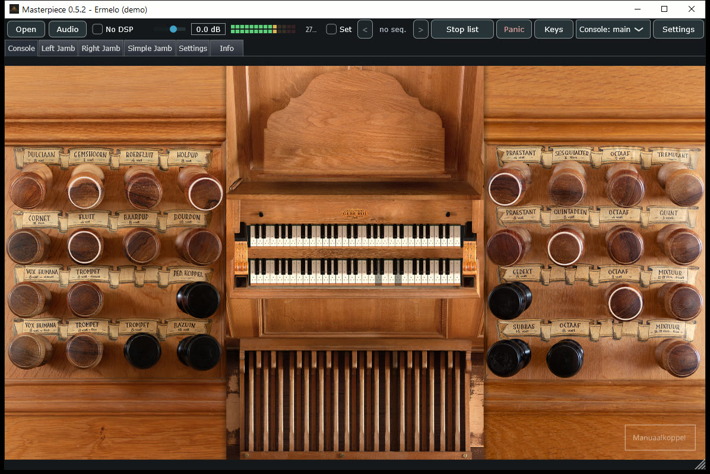 |
| demonstration set · [sample set by Piotr Grabowski](https://piotrgrabowski.pl/pinerolo/) | demonstration set · [sample set by Piotr Grabowski](https://piotrgrabowski.pl/ermelo/) |
| **Święta Lipka** — pipes reached through pallet switches | **Nitra** |
| 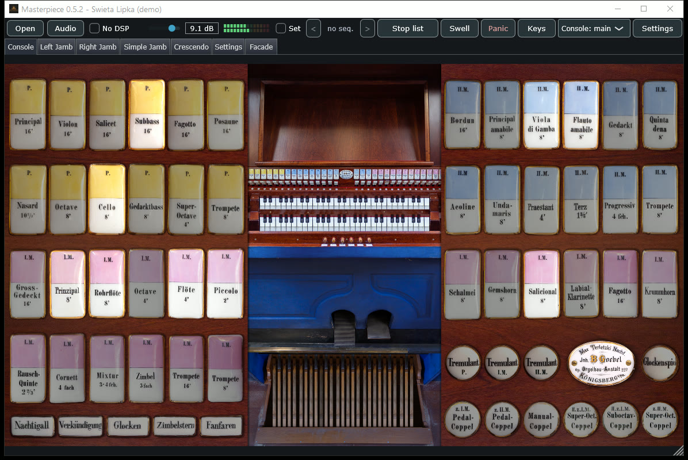 | 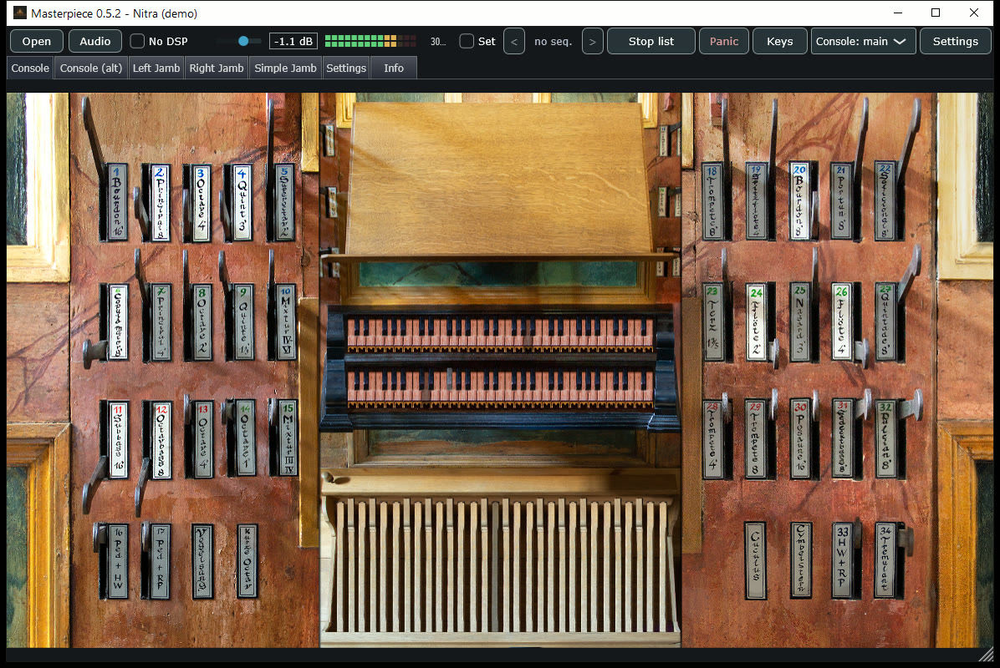 |
| demonstration set · [sample set by Piotr Grabowski](https://piotrgrabowski.pl/swieta-lipka/) | demonstration set · [sample set by Piotr Grabowski](https://piotrgrabowski.pl/nitra/) |
| **Erfurt-Büßleben** | **Erfurt, Predigerkirche** — pipes reached through pallet switches |
| 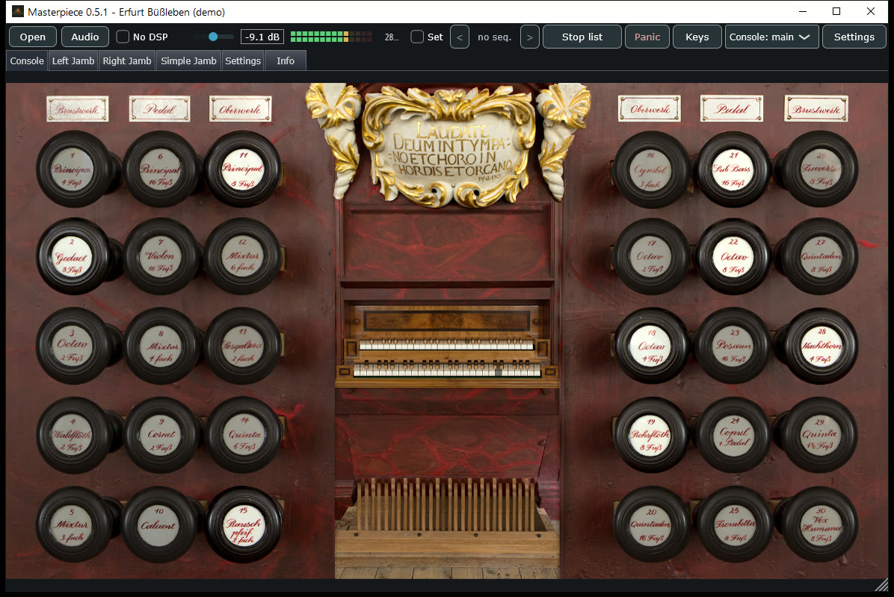 | 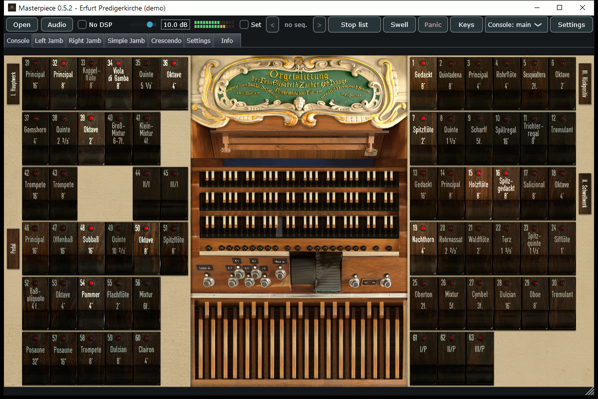 |
| demonstration set · [sample set by Piotr Grabowski](https://piotrgrabowski.pl/erfurt-bussleben/) | demonstration set · [sample set by Piotr Grabowski](https://piotrgrabowski.pl/erfurt-predigerkirche/) |
| **Obervellach** | **Düren** |
| 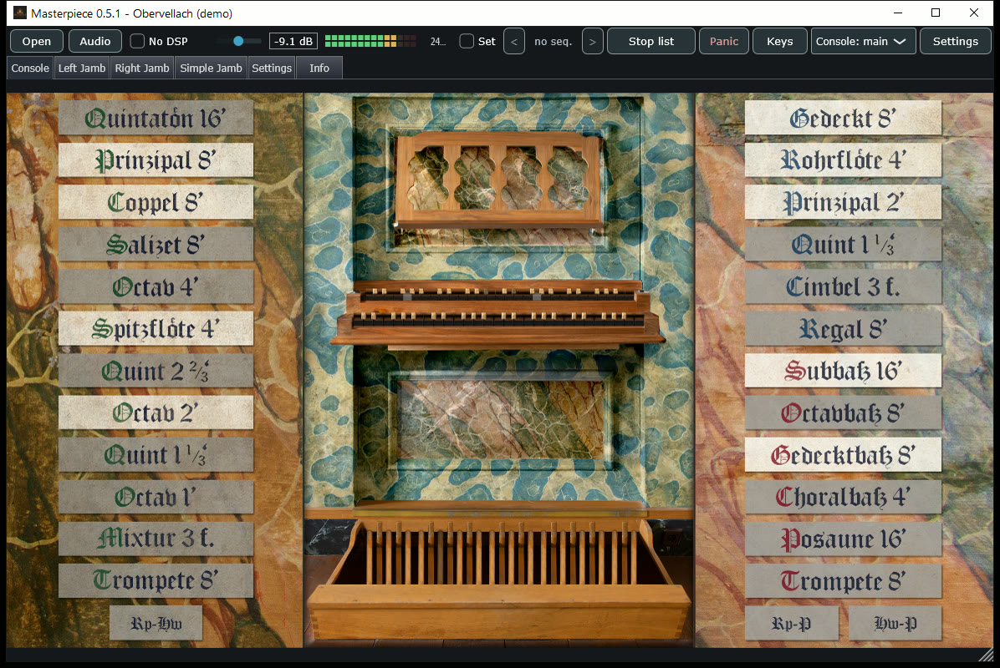 | 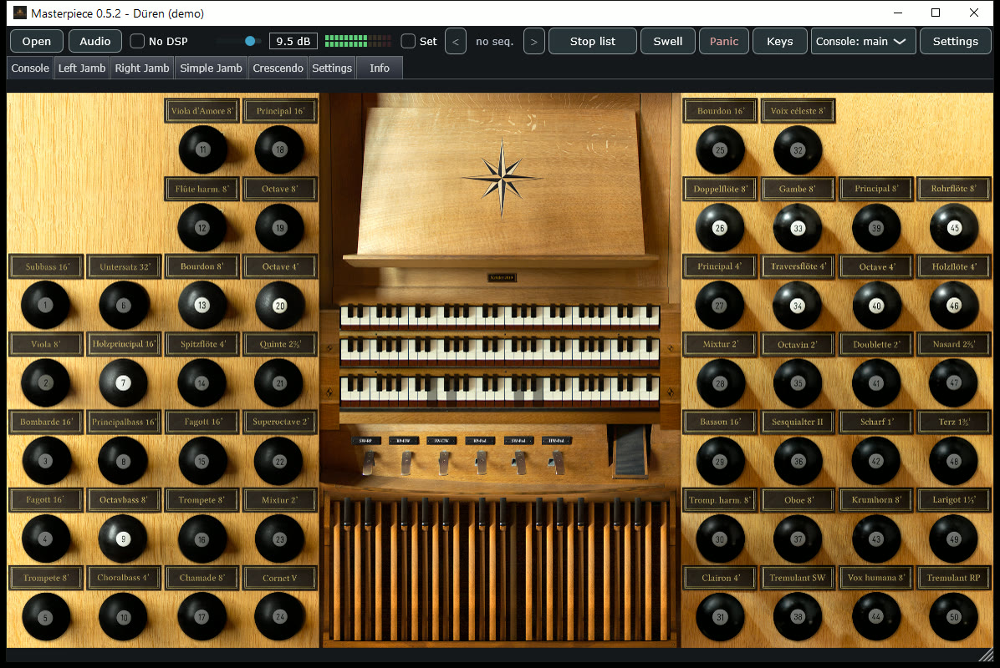 |
| demonstration set · [sample set by Piotr Grabowski](https://piotrgrabowski.pl/obervellach/) | demonstration set · [sample set by Piotr Grabowski](https://piotrgrabowski.pl/duren/) |
| **Chorzów, St Hedwig of Silesia** | **Goch** |
| 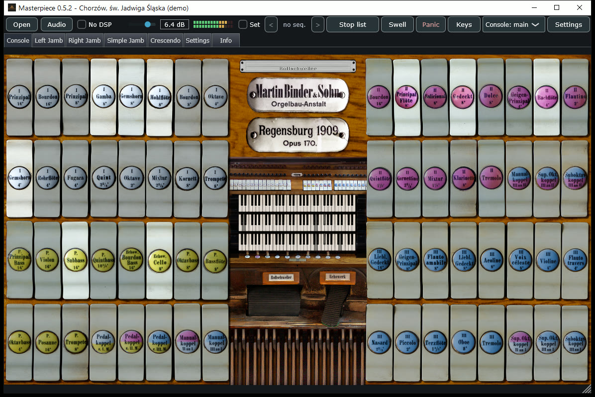 | 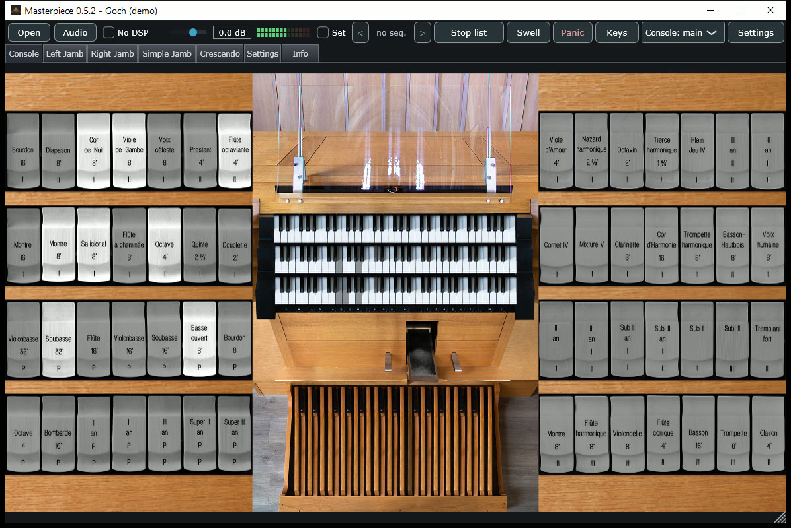 |
| demonstration set · [sample set by Piotr Grabowski](https://piotrgrabowski.pl/chorzow-sw-jadwiga-slaska/) | demonstration set · [sample set by Piotr Grabowski](https://piotrgrabowski.pl/goch/) |
| **Oloron-Sainte-Marie** | **Bégard** |
| 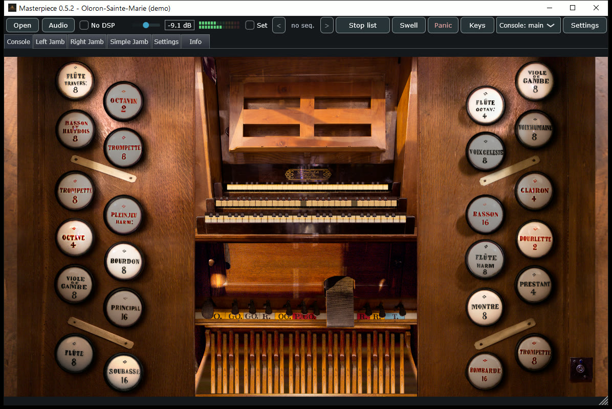 | 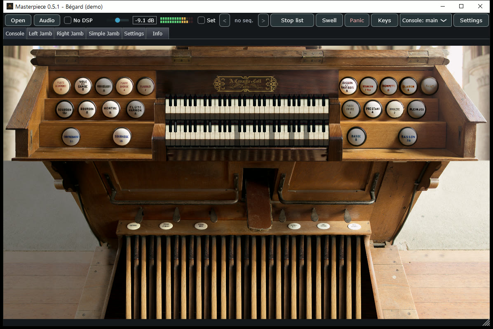 |
| demonstration set · [sample set by Piotr Grabowski](https://piotrgrabowski.pl/oloron-sainte-marie/) | demonstration set · [sample set by Piotr Grabowski](https://piotrgrabowski.pl/begard/) |

Each organ above is a freely published sample library, separate from this
repository. Twenty-three of the twenty-four are produced by [Piotr
Grabowski](https://piotrgrabowski.pl/); the other by [Augustine's Virtual
Organs](https://hauptwerk-augustine.info/). Most of the newer ones are his
demonstration sets, which include only some of each organ's stops. Full
credits: [ATTRIBUTION.md](ATTRIBUTION.md).

Sets that ship several console sizes offer them all; the chooser only appears
when there is a choice to make. Drawn keys and drawstops are clickable, and a
set whose manuals are part of a photographed backdrop falls back to an
on-screen keyboard instead.

---

## Using it

**Loading.** A large library is tens of gigabytes and takes minutes off a slow
disk, so it loads on its own thread: the window stays live, the progress is
real, and the estimate is built from the rate the load actually achieves.
Cancel takes effect at the next file and throws
away what it had read. A cancelled load leaves no partial organ behind.


**Playing.** Drawstops, pistons and expression shoes are where the builder put
them. A key pressed with the mouse takes the same path as that note arriving
over MIDI, so anything done from the console works from a real one. The meter
shows what reaches the audio device — after the room, the organ's own level
and the master fader.


**Registering without artwork.** The stop list covers sets with no console
picture, or stops spread across several jambs: the same registration,
grouped by division.


**The engine.** What costs CPU and what costs memory, in one place. *Simple WAV
only* bypasses every refinement at once for a machine that cannot afford them.
Preload and resident format decide how much of a library has to fit in RAM;
streaming holds only the head of each release tail and fetches the rest while
it plays. Disk writes happen only on request — changes apply immediately,
and you choose afterwards whether to forget them, keep them for this organ, or
make them the default for every organ.


**Routing.** Sample libraries describe no audio routing. Output pairs and
their device channels carry across organs; which rank goes where is saved
per organ, because a rank
number means nothing in a different instrument. An unrouted rank plays
through the first pair, so an organ is audible before you open this page. In
stereo the pairs are summed, so every rank stays audible when you split them up.


**Voicing.** Rank and per-pipe level and tuning adjustments add, so correcting
one pipe keeps the rank trim.
A and B are two complete sets for direct comparison of a change against
what was there before. Level and tuning are a multiply and a ratio taken
once when a note starts, so they cost nothing while it sounds and work with the
DSP switched off.


**Getting back to an organ.** Favourites point at numbered slots, which thumb
pistons trigger. Combination sets hold whole registration books —
one for a recital, another for a service — and changing set saves the one you
are leaving first.


**Your console.** Which manual a key plays is decided by its MIDI channel, and
each console is wired differently. Right-click a drawstop and
move the real one to learn it; the sequencer pistons and the page-turn actions
get their own learn buttons, with nothing on screen to right-click.


**Jamb displays.** The little text panel on a wired console, driven by system
exclusive. The bytes that introduce the message belong to the display hardware,
so you type them in, and only lines whose text actually changed are sent.


**Practising and recording.** A MIDI recording is the performance and can be
replayed through a different registration; the audio capture is what it sounded
like. Record both at once.


**The room.** Convolution reverb for libraries recorded dry. A library recorded
in its own building already carries that acoustic in the samples; a second
room on top muddies it.


---

## Performance

Measured on a 44-stop, 17 GB set. Method and full figures:
[PERFORMANCE.md](PERFORMANCE.md).

- **Memory:** up to **9.3x less** than holding every sample as 32-bit float.
  Samples are held at 24-bit, bit-for-bit identical to the files (1.3x
  less), or at 16-bit; a stereo set can be folded to mono as it loads.
  Release tails stream from disk into per-voice ring buffers refilled by a
  background thread, leaving 56% of the sample data on disk. 21.6 GB at
  32-bit float becomes 16.2 GB at 24-bit, 4.65 GB at 16-bit with releases
  streamed, 2.33 GB folded to mono. Sample data can be converted to the
  device's rate as it loads, for libraries recorded at 96 kHz.
- **Loading:** the organ opens up to **3x faster**. Decoded samples are kept
  as one cache file, so the next load of the same organ is one read instead
  of 12,148 decodes: up to **5x faster** sample loading. The cache is keyed
  to the definition and every setting that changes the bytes, so a changed
  setting rebuilds it instead of reading a stale one. One file by default,
  replaced as organs change; one per organ, or off.

---

## Building

Requires a C++20 compiler (MSVC 2022, GCC 12+, or Clang 14+), CMake 3.22+ and
Ninja. JUCE and pugixml are fetched automatically.

```bash
cmake --preset dev
cmake --build --preset dev
```

Presets are also provided for each CI target: `ci-linux`, `ci-macos`,
`ci-windows`, and `ci-linux-arm`, which cross-builds for 32-bit Raspberry Pi.

---

**Tests.** The suite needs no sample library and runs in about a second:

```
cmake --build --preset dev --target mp_tests
build/dev/tests/mp_tests --no-perf      # --perf-only for the timing ones
```

It covers the loader, the switch network and key flow, the voice engine, MIDI
mapping and the DSP, against hand-written organ definitions in
`tests/fixtures`. CI runs it on every target that can execute its own build.

---

**Releasing.** Every published file carries its version in the name, and the
download links above point at a tagged file, so the version lives in two
places. `cmake/set-version.sh 0.4.2` sets both; commit that, merge it, then
tag `v0.4.2` and the release workflow builds and publishes everything.

---

## Installing

**Windows.** Run `masterpiece-0.5.4-windows-setup.exe`. It installs
Masterpiece with a Start menu entry, and removes it again from
*Settings → Apps*. The portable `masterpiece-0.5.4-windows.zip` needs no
installation and carries the VST3 plugin.

**Debian, Ubuntu, Raspberry Pi OS.** Install the package with `apt`, which
fetches anything it needs:

```
sudo apt install ./masterpiece-0.5.4-linux-amd64.deb     # PC
sudo apt install ./masterpiece-0.5.4-linux-arm64.deb     # Raspberry Pi OS, 64-bit
sudo apt install ./masterpiece-0.5.4-linux-armhf.deb     # Raspberry Pi OS, 32-bit
```

Masterpiece then appears in the applications menu and runs as `masterpiece`.
The PC package also installs the plugins, to `/usr/lib/vst3` and
`/usr/lib/lv2`. Remove it with `sudo apt remove masterpiece`. The `.tar.gz`
archives remain for other distributions.

**macOS.** Unzip and move `Masterpiece.app` to Applications. The download is
not yet signed by Apple, so Gatekeeper may call it "damaged"; clear the
quarantine flag, then right-click the application and choose Open:

```
xattr -cr /Applications/Masterpiece.app
```

---

## Running

Launch the app, then **Load organ…** and choose the set's XML definition.

Two flags are useful for skipping a multi-gigabyte load:

```
Masterpiece --odf "<path to the definition>" --gui-only
```

`--gui-only` builds the entire console and reads no audio at all: the organ is
silent and appears in a second or two. `--log <file>` writes the load timings,
if you want to know where the time went.

**Audio driver, on Windows.** The settings page lists Windows Audio (shared),
Windows Audio (exclusive), DirectSound and — when a driver for your interface
is installed — ASIO. Exclusive mode and ASIO are the two worth trying: a
shared-mode device adds enough delay between key and pipe to be felt at the
keyboard. ASIO appears only if an ASIO driver is present, which normally means
the one that came with your audio interface.

**Audio driver, on Linux.** The audio panel offers two device types, ALSA and
JACK, and it is worth trying both. On a current distribution JACK is usually
PipeWire answering in JACK's place, and on a machine where one route is silent
the other often is not. Masterpiece appears in a patchbay under its own name.
The JACK type is listed only when a JACK library is installed — on Fedora that
is the `pipewire-jack-audio-connection-kit` package, on Debian and Ubuntu
`pipewire-jack` or `libjack-jackd2-0`.

---

## How it is built

| | |
|---|---|
| Language | C++20 |
| Audio and GUI | JUCE 9 |
| XML | pugixml |
| Build | CMake + Ninja, command line only |
| Platforms | Windows, macOS (Apple silicon and Intel), Linux; Raspberry Pi via cross-build |
| Formats | Standalone, VST3, LV2, AU on macOS |

The engine is split so the parts with no user interface can be tested without
one:

```
mp_core      the XML loader, the validator, the temperament solver
mp_sampler   the voice engine and the streaming backend
mp_control   key flow, couplers, the switch network, pistons, crescendo, wind
mp_dsp       enclosure filters and tremulant modulation
mp_audio     the audio processor, sample storage, routing
mp_ui        the console, the panels, MIDI learn
```

`mp_core`, `mp_sampler` and `mp_control` carry no JUCE at all, which is what
lets the whole musical path be exercised against a synthesised tone instead of
a 40 GB library.

---

## Credits

Masterpiece owes a real debt to four open-source projects. Their authors
worked out, and generously published, much of what anyone building a player
like this has to understand, and their work was a constant reference:

- **[GrandOrgue](https://github.com/GrandOrgue/GrandOrgue)** — for showing
  what a mature pipe organ player has to get right, above all a release that
  does not click
- **[OdfEdit](https://github.com/GrandOrgue/OdfEdit)** — for the clearest
  public explanation of the organ-definition format: which objects exist, how
  they connect, and where a conversion has to give way
- **[rusty-pipes](https://github.com/dividebysandwich/rusty-pipes)** — for its
  generous sharing of hard-won knowledge about samples, loops and file formats
- **[HISE](https://github.com/christophhart/HISE)** — for the idea of streaming
  samples from disk through small per-voice buffers refilled in the background

Sample libraries and MIDI sequences are credited in
**[ATTRIBUTION.md](ATTRIBUTION.md)**.

---

## Licence

Hauptwerk is a trademark of its owner. Masterpiece is an independent project.

GPL-3.0-only. See [`LICENCE`](LICENCE) and [`COPYING`](COPYING).

The Windows build includes ASIO support. The Steinberg ASIO SDK is offered
under either the Steinberg ASIO License or the GPL version 3; Masterpiece uses
it under the GPL arm, which is what makes it distributable here at all. The
headers ship with JUCE, in `modules/juce_audio_devices/native/asio/`. ASIO is a
trademark and software of Steinberg Media Technologies GmbH.
